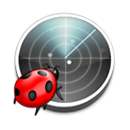

# BugsRadar plugin for Claude

[BugsRadar](https://bugsradar.com) sends the errors, alerts and notifications of your applications and scripts to your own chat. The first occurrence of an error arrives at once with where it happened and the stack trace, and repeats are counted in that message. Channels and plans: https://bugsradar.com/channels/

This plugin teaches Claude to work with BugsRadar: add it to a project, make scripts and jobs report their own failures, read the messages that arrive, and send a short notification from Claude to your chat when you ask for one.

## What you get

Skills, which Claude uses on its own when your request fits, and commands, which you run by name.

| Skill | What it does |
|---|---|
| `setup` | Connects BugsRadar to a .NET, Node.js or Python project, after asking you first |
| `script-alerts` | Makes cron jobs, systemd services, Task Scheduler tasks, SQL Server Agent jobs, backups and CI/CD pipelines report their own failure |
| `notify` | Sends a short message from Claude to your chat, only when you ask |
| `claude-key-setup` | Explains and sets up the key Claude uses for its own notifications |
| `read-alert` | Explains a BugsRadar message you paste and finds its cause in your code |
| `silent-failures` | Finds swallowed errors that nobody would hear about |
| `write-good-alerts` | Writes alert text, level, category and environment so repeats group well |
| `deploy-messages` | Adds failed and finished deploy messages to GitHub Actions, GitLab CI/CD, Azure Pipelines or Jenkins |
| `background-jobs` | Reports failures of workers, consumers and job runners, with retries counted |
| `environments` | Separates production, staging and development |
| `seq-clef` | Sends errors from a project that already uses Seq, with no new package |
| `any-language` | One HTTP request for languages without a package: Go, PHP, Ruby, Java and others |
| `troubleshoot` | Finds out why a message did not arrive |

| Command | What it does |
|---|---|
| `/bugsradar:setup` | Connect BugsRadar to the current project |
| `/bugsradar:notify <text>` | Send a short notification from Claude |
| `/bugsradar:doctor` | Check the key and send a test message |
| `/bugsradar:audit` | Audit the project for swallowed errors (read-only) |
| `/bugsradar:script <file>` | Make a script report its own failure |

## Install

Add BugsRadar from the Claude plugin directory (Customize, then Plugins). To try a local copy in Claude Code, start it with `claude --plugin-dir ./bugsradar-claude-plugin`.

## Keys: one for Claude, one for each project

BugsRadar identifies a project by its API key, and the key decides which chats receive a message. This plugin uses keys in two different ways:

1. **The key for Claude** is the key of a BugsRadar project you keep for Claude's own messages. It is the only key this plugin needs, in the environment variable `BUGSRADAR_KEY_FOR_CLAUDE`. You create the project and the channel yourself at https://app.bugsradar.com/ (Claude has no account), copy the key and set the variable. In Claude Code you can use a different key per project (an `env` block in `.claude/settings.local.json`), per session (set the variable in the terminal before starting `claude`), or one for everything (a user variable). The `claude-key-setup` skill walks you through it. Never paste the key into the chat.
2. **The key of your own project** is used by that project's code to send its errors and alerts. The plugin never reads it and never asks for it. If you ask Claude to connect BugsRadar to a project, Claude installs the package, writes the code that reads the key from configuration, and asks you to put the key in place yourself.

Sending notifications from Claude needs a shell on your computer and the variable, so it is meant for Claude Code. The other skills help in any Claude app.

## What the plugin sends, and where

- Only the `notify` skill, `/bugsradar:notify` and `/bugsradar:doctor` send anything. They send an HTTPS request to `https://api.bugsradar.com/api/v3/notify` with the text you asked Claude to send, an optional level and category, and your key for Claude in the `X-Api-Key` header. Claude sends a message only when you ask: with a command, or with an instruction in your prompt such as "when you finish, send me a BugsRadar message". The text is a short line, and never code, file contents, command output or secrets.
- The keys are BugsRadar keys and go only to `api.bugsradar.com`, the API of BugsRadar itself, never to any other host.
- The plugin has no telemetry and sends nothing else anywhere. It does not read your project's keys, `.env` files or secret stores.
- When you ask Claude to connect BugsRadar to a project, it installs the BugsRadar package from NuGet, npm or PyPI on your machine, as you requested, and edits your project's files. You review the diff.
- BugsRadar keeps no messages: a message stays in memory only until it is delivered to your chat. Privacy policy: https://bugsradar.com/privacy-policy/. Terms: https://bugsradar.com/terms-of-use/.

## Limits

BugsRadar reports a failure that the code or script reports. It cannot tell that a job never ran at all (no heartbeat), it keeps no history and has no dashboard. Nothing in this plugin changes that.

## Docs and support

Docs: https://bugsradar.com/docs/. A machine-readable map of the docs: https://bugsradar.com/llms.txt. Support: support@bistriy.com.

## License

MIT, see [LICENSE](LICENSE).
